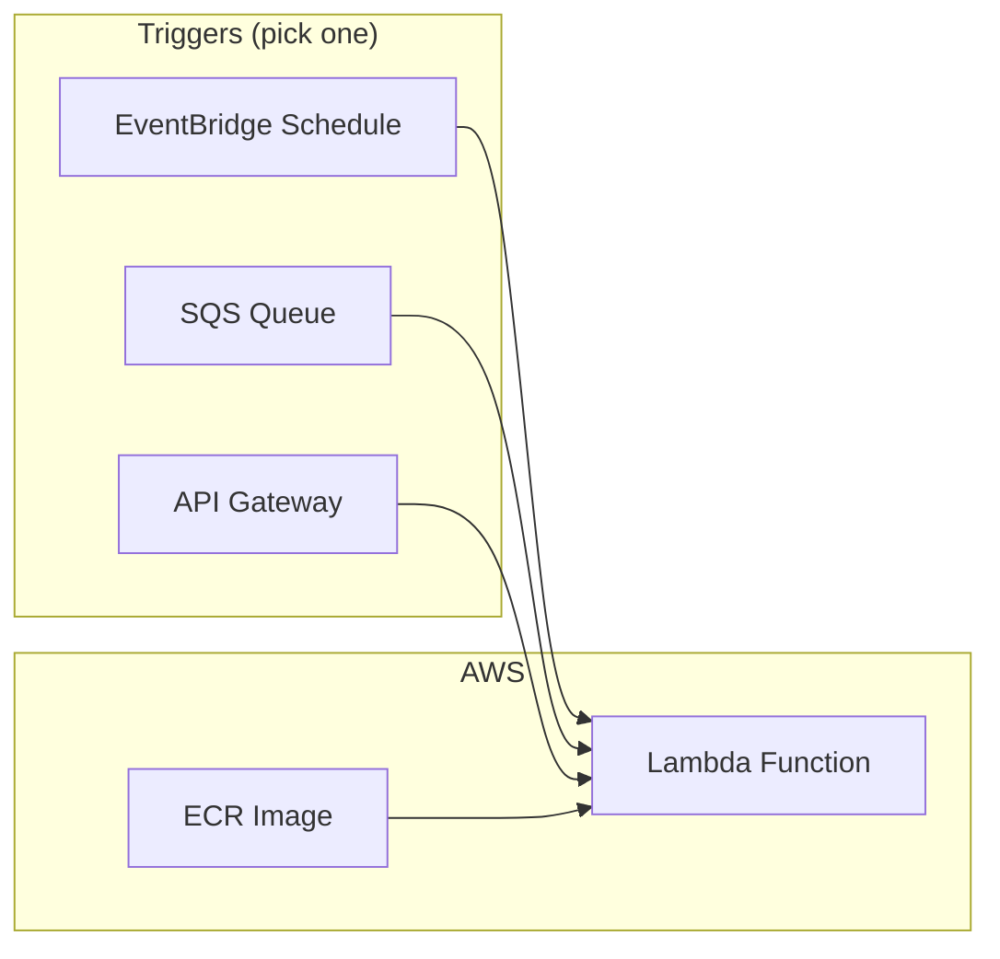
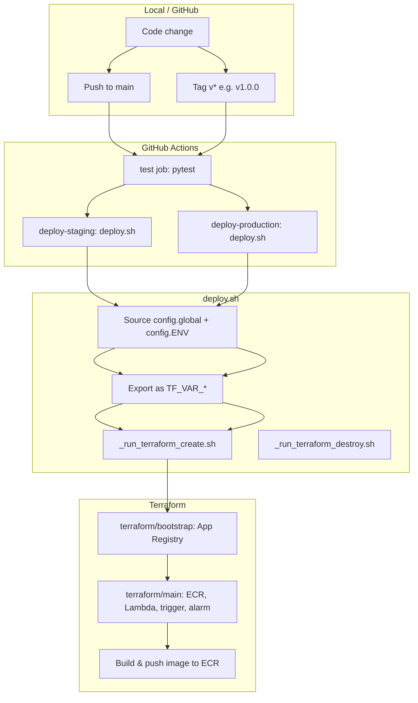
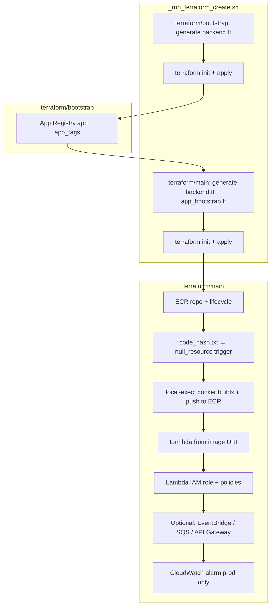
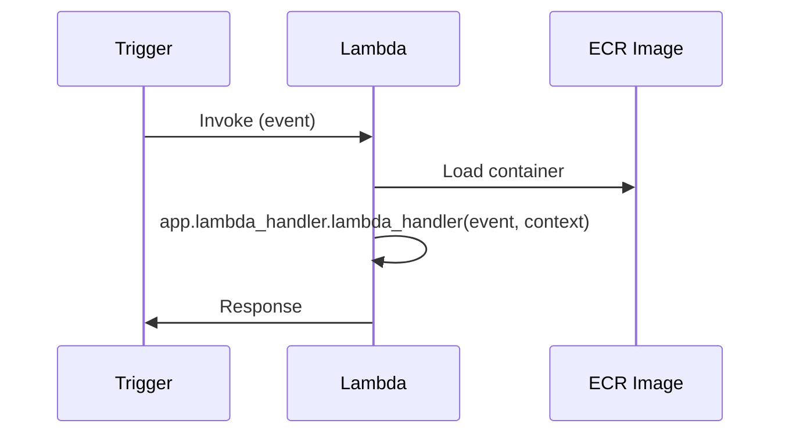
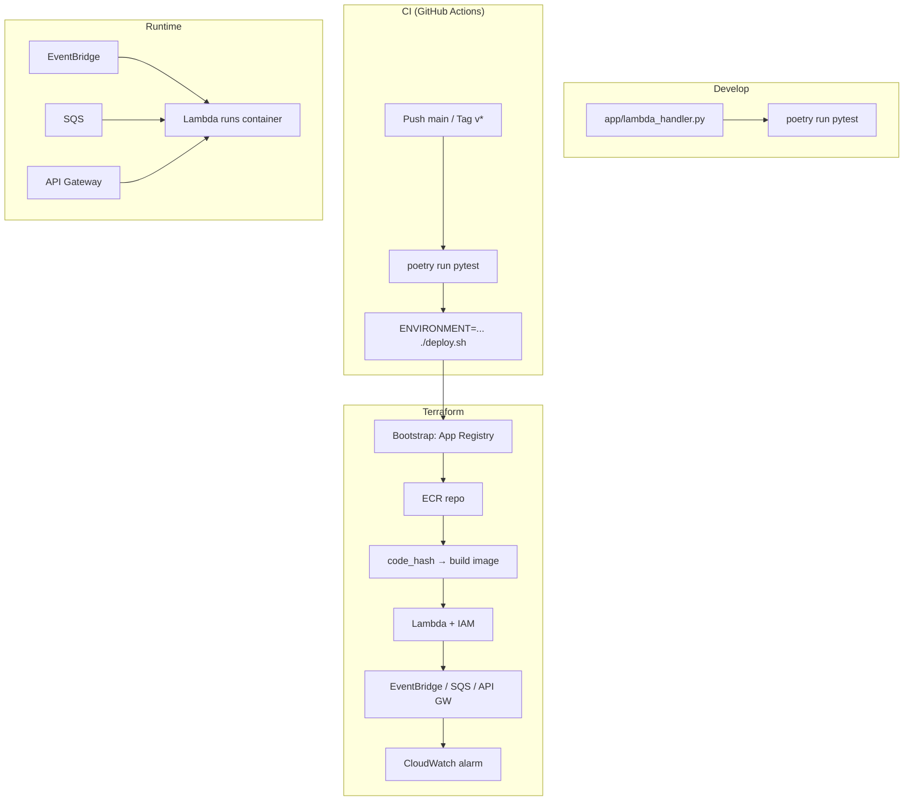

# How This Project Works

Python AWS Lambda template that can be triggered by **EventBridge (schedule)**, **SQS**, or **API Gateway**. You enable **one** trigger via **trigger_type** in config and its handler; the rest stay disabled.

---

## 1. High-level flow



- **Lambda** runs your code; it's packaged as a **Docker image** stored in **ECR**.
- **Terraform** creates: ECR repo, Lambda (image URI from ECR), IAM, and the chosen trigger (EventBridge / SQS / API Gateway) based on **trigger_type**.
- **CI/CD**: GitHub Actions runs tests, then (on `main` or version tag) runs `deploy.sh`, which runs Terraform and builds/pushes the image.

---

## 2. Deployment / CI-CD flow



- **Push to `main`** → tests run → **staging** deploy (`ENVIRONMENT=staging ./deploy.sh`).
- **Push tag `v*`** → tests run → **production** deploy (`ENVIRONMENT=prod ./deploy.sh`).
- **Tag `destroy-staging-*`** or **`destroy-prod-*`** → same flow but runs `deploy.sh -d` (Terraform destroy).

---

## 3. Terraform create path (detail)



- **Bootstrap** runs first: creates the app in AWS App Registry and outputs `app_tags`; state in S3.
- **Main** reads bootstrap state, creates ECR, computes code hash, builds/pushes image, then creates Lambda (with that image tag), IAM, the trigger selected by **trigger_type** (count-based), and (prod) alarm. If a **cycle** is detected when switching triggers, a two-phase apply runs (trigger_type=none then desired value).
- Lambda **CMD** in Dockerfile: `app.lambda_handler.lambda_handler` → you must have `app/lambda_handler.py` with a `lambda_handler(event, context)`.

---

## 4. Trigger → Lambda (runtime) flow



- **EventBridge**: schedule invokes Lambda with a fixed payload (e.g. `{}`).
- **SQS**: Lambda is the queue consumer; `event` contains `Records[]` with `body`.
- **API Gateway**: proxy integration; `event` is API Gateway request format (HTTP method, path, headers, body).

---

## 5. Run locally

### Prerequisites

- **Python 3.12** and **Poetry**
- **Docker** (for deploy and for optional local Lambda run)
- **`.env`** in project root: `PYTHONPATH=app`

### One-time setup

```bash
# Venv in project
poetry config virtualenvs.in-project true
poetry env use python3.12
poetry install

# .env
echo "PYTHONPATH=app" > .env
```

### Enable one handler (and its test)

Only one handler should be active; it must be named `app/lambda_handler.py`:

```bash
# Example: SQS
mv app/lambda_handler_sqs.py.disabled app/lambda_handler.py
mv tests/unit/app/lambda_handler_test_sqs.py.disabled tests/unit/app/lambda_handler_test_sqs.py
```

(Use the corresponding `lambda_handler_*.py.disabled` and test file for EventBridge or API Gateway if you prefer.)

### Run tests

```bash
poetry run pytest tests/unit
```

### Run Lambda in Docker locally (optional)

After you have an image (e.g. built and pushed to ECR, or built locally and tagged):

```bash
# Login to your ECR (replace region and repo URL)
aws ecr get-login-password --region us-west-2 | \
  docker login --username AWS --password-stdin <account>.dkr.ecr.<region>.amazonaws.com/<repo>

# Run (replace image name)
docker run --rm -p 9000:8080 -it <ecr-repo-url>:latest

# Invoke (empty event)
curl -XPOST "http://localhost:9000/2015-03-31/functions/function/invocations" -d '{}'
```

For SQS-style test, send a payload with `Records`; for API Gateway, send the API Gateway event shape.

---

## 6. Deploy (what you need to know)

### Pre-requisites

- **AWS**: OIDC role for GitHub (or equivalent) and an **S3 bucket** for Terraform state (e.g. from [nrdtech-terraform-aws-account-bootstrap](https://github.com/NRD-Tech/nrdtech-terraform-aws-account-bootstrap)).
- **Config**: `config.global` (and `config.staging` / `config.prod`) set with at least:
  - `APP_IDENT_WITHOUT_ENV`, `TERRAFORM_STATE_BUCKET`, `AWS_DEFAULT_REGION`, `AWS_ROLE_ARN`, **trigger_type**
  - For API Gateway: `API_ROOT_DOMAIN`, `API_DOMAIN` in env-specific configs.

### Enable GitHub Actions

```bash
mv .github/workflows/github_flow.yml.disabled .github/workflows/github_flow.yml
```

### Choose the trigger (Terraform)

Set **trigger_type** in config.global (or config.\<env\>): `trigger_type=api_gateway`, `trigger_type=sqs`, or `trigger_type=eventbridge`. All three Terraform trigger files are always present; only the one matching trigger_type is applied. Switching triggers is done by changing this value and re-deploying (two-phase apply runs automatically if a cycle is detected).

### Deploy via GitHub

| Goal              | Action |
|-------------------|--------|
| Deploy **staging** | Push to `main`: `git push origin main` |
| Deploy **production** | Tag and push: `git tag v1.0.0` then `git push origin v1.0.0` |
| Destroy staging   | Tag: `destroy-staging-<something>`, push tag |
| Destroy prod      | Tag: `destroy-prod-<something>`, push tag |

Workflow runs tests, then `ENVIRONMENT=staging ./deploy.sh` or `ENVIRONMENT=prod ./deploy.sh` (or with `-d` for destroy). No manual `deploy.sh` run needed for normal deploys if you use GitHub Actions.

### Deploy from your machine (manual)

- Set **OIDC token** for AWS (e.g. write token to `web-identity-token` and set `AWS_WEB_IDENTITY_TOKEN_FILE`), or use another auth method Terraform respects.
- Then:

```bash
ENVIRONMENT=staging ./deploy.sh        # create/update
ENVIRONMENT=staging ./deploy.sh -d    # destroy
ENVIRONMENT=prod ./deploy.sh
ENVIRONMENT=prod ./deploy.sh -d
```

`deploy.sh` sources `config.global` and `config.${ENVIRONMENT}`, exports all vars as `TF_VAR_*`, then runs `_run_terraform_create.sh` or `_run_terraform_destroy.sh`.

---

## 7. Config and code hash

- **config.global**: Shared (e.g. `APP_IDENT_WITHOUT_ENV`, `TERRAFORM_STATE_BUCKET`, `AWS_DEFAULT_REGION`, `AWS_ROLE_ARN`, **trigger_type**, `APP_TIMEOUT`, `APP_MEMORY`, `CPU_ARCHITECTURE`). It also builds **code_hash.txt** under `terraform/main/` from a `find` of relevant files; that hash drives the `null_resource.push_image` trigger so code changes cause a new image build and Lambda update.
- **config.staging** / **config.prod**: Environment-specific overrides (e.g. `API_DOMAIN` for API Gateway).

---

## 8. Summary diagram (all in one)



You run it **locally** by: set `PYTHONPATH=app`, enable one handler as `app/lambda_handler.py`, run `poetry run pytest`; optionally run the same image in Docker and hit the Lambda runtime API. You **deploy** by: configuring `config.global` (including **trigger_type**) and env configs, enabling the GitHub workflow, then pushing to `main` (staging) or pushing a `v*` tag (production).
